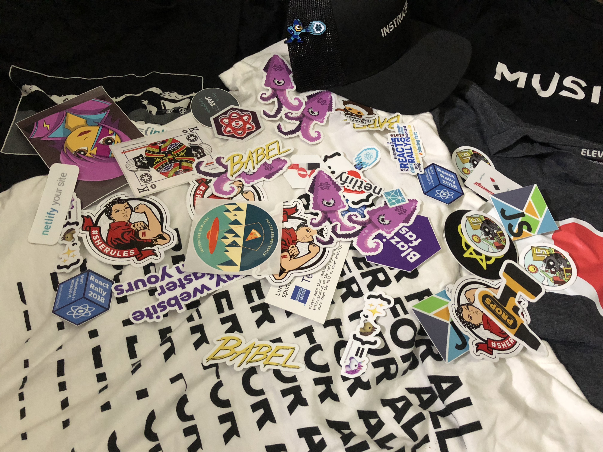
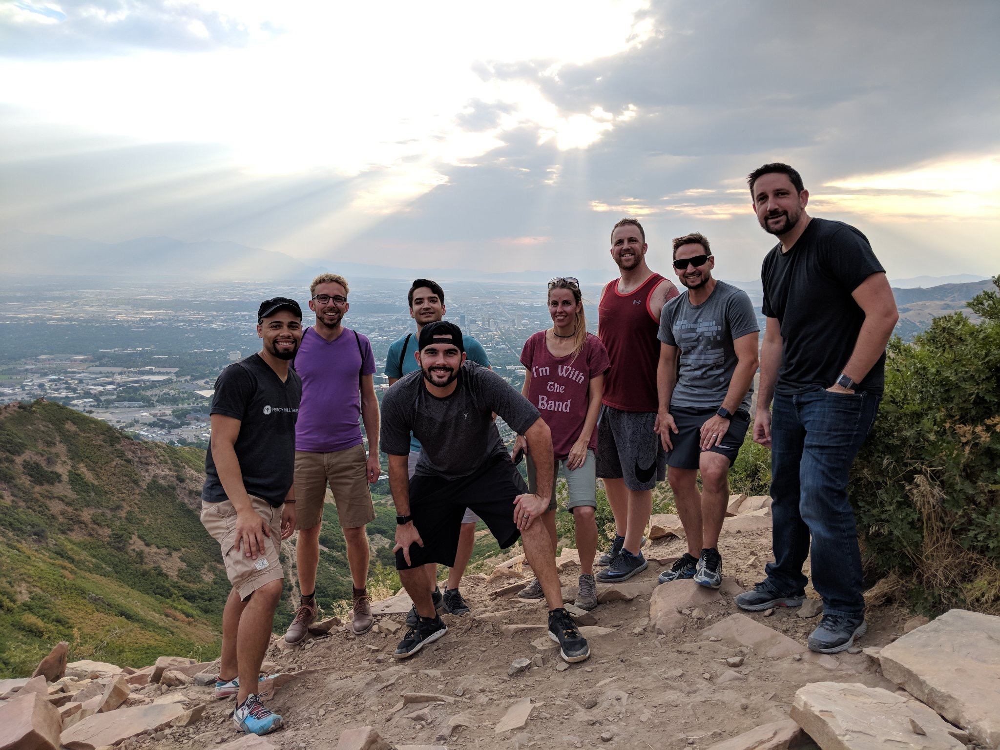

 

Last week was React Rally, and I am so thankful that I attended. React Rally is a single track two day conference held
annually in Salt Lake City. I want share some tips that may help at your first or next conference you attend. (tips are not
in any order.)

## 1. Find conference buddies (ahead of time)

After I bought my ticket for React Rally, I immediately made a tweet to express
my excitement. I even suggested I was open to Airbnb with others.

  <blockquote class="twitter-tweet">
Just bought my <a href="https://twitter.com/ReactRally?ref_src=twsrc%5Etfw">@ReactRally</a> ticket! Now, who wants to get an Airbnb? 😎
&mdash; Jon Major Condon (@jonmajorc) <a href="https://twitter.com/jonmajorc/status/984134686632013824?ref_src=twsrc%5Etfw">April 11, 2018</a></blockquote> 

 

It worked too — Andrew Del Prete <a href="https://twitter.com/AndrewDelPrete" class="box-shadow-twitter">(@AndrewDelPrete)</a> contacted me! His coworkers were in agreement with
letting an outsider in, so I roomed with many other awesome developers in a phenomenal looking Airbnb for the conference.
He and his coworkers were daily my conference buddies, and we were able to meet a lot of people with the help of each other.
Having one or more conference buddy can help you meet many people fast, and it could help make meeting others less
intimidating.

## 2. Surround yourself with others

The day before the conference we hiked and had dinner with many other developers. Few developers showed up for hiking
and the rest for dinner. Either way, we met many developers before the first day of the conference! The hike left my
legs exhausted, but it didn't slow me down at all when it came to meeting new people.

 

## 3. Allow others to join conversations

Introduce yourself and engage in a conversation beside the person. Standing face-to-face makes it a one-on-one
conversation that warns off others. So be sure to leave an opening for a person to join -- the awesome bearded Kyle
Shevlin <a href="https://twitter.com/kyleshevlin" class="box-shadow-twitter">(@kyleshevlin)</a> shared that tip! I personally made it an effort to continue this practice the rest of the conference when
talking to anyone. I noticed it worked well too! I met many more developers when doing this because others felt accepted
to join the conversation.

## 4. Ask the group to catch you up

Joining a conversation can be awkward... Don't let the awkwardness stop you! Simply introduce yourself and ask to be
caught up with what's being discussed. It's totally cool... Get into the groove of joining a conversations late and not
knowing anything that's being discussed. It happens to often so don't allow it to stop you.

## 4. Talk to as many folks as possible

You will have many opportunities to connect with others. I know you want to talk to the speakers, but don't limit
yourself from talking to those in the crowd. Introduce yourself too as many people and attempt to make deep connections
where possible; It's okay to keep conversations surface level too. There are so many people to meet in such a short
amount of time!

## 5. Respectful to others time

Not only is your time valuable, but the people you meet too. Conversations will run short sometimes, but it's okay to
keep the conversations short. You can always follow up throughout the day. If you want to continue the conversation, but
you want to meet more people -- ask about lunch plans or evening plans.

## 6. Set conference goals

Set a goal. A friend at this conference set a goal for herself to talk to as many other female devs. I’ve also hear of
people setting a goal as far as meeting anyone wearing a blue shirt. Sometimes setting a goal such as these can help
motivate meeting someone new. Try it!

## 7. Follow ups...

Be sure to follow up with those you met! Go drop them a DM.

  <blockquote class="twitter-tweet" data-lang="en">
My Life Pro Tip: after a conference, within a week, take the time to reach out to the people you met and say something thoughtful. Doesn&#39;t have to be long, but a sincere &quot;I&#39;m glad we met&quot; goes a long way towards building a relationship, professional and otherwise.
&mdash; Kyle Shevlin (@kyleshevlin) <a href="https://twitter.com/kyleshevlin/status/1032288824838090752?ref_src=twsrc%5Etfw">August 22, 2018</a></blockquote>

 

My next conference I am attending is <a href="http://faithleads.tech/" class="box-shadow-faithLeads">Faith Leads Tech</a> in Tennessee! Don't hesitate to drop me a DM on Twitter if you will be around. I would love to grab some coffee and talk 👋
