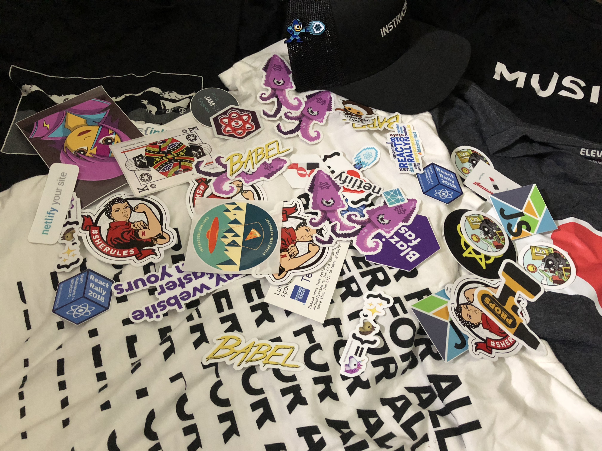
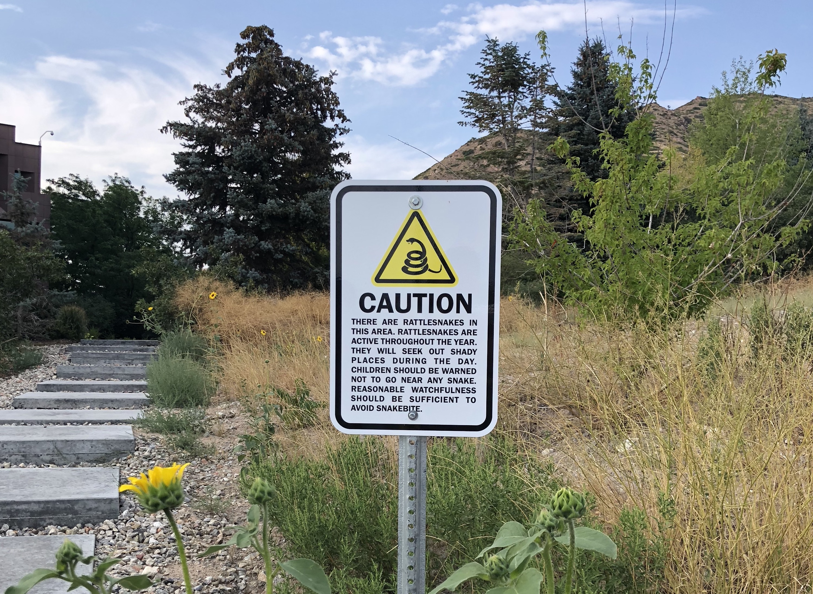
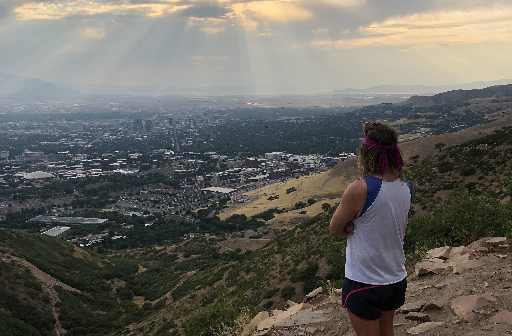

 

<!-- React Rally may be over, but so many friends were made! -->

I remember being super excited about attending my first React Rally conf, so excited, it led me to tweet what is below...

<blockquote class="twitter-tweet">
Just bought my <a href="https://twitter.com/ReactRally?ref_src=twsrc%5Etfw">@ReactRally</a> ticket! Now, who wants to get an Airbnb? 😎
&mdash; Jon Major Condon (@jonmajorc) <a href="https://twitter.com/jonmajorc/status/984134686632013824?ref_src=twsrc%5Etfw">April 11, 2018</a></blockquote> 
 

Andrew Del Prete reached out to me and we started planning rooming together at the Sheraton Hotel where the conference was being held. Eventually the plan was altered so other developers from Music Bed could join; thankfully they picked an Airbnb that was large enough to accommodate everyone, including myself. The past few days I lived with some awesome people, and became more than Twitter friends. We had "shallow" conversations, yet some deep ones (JESUS 🙌). I am itching to get back to React Rally next year -- literally I am itchy right now. I managed to be bit by some Utah creature, probably a mosquito before leaving -- thankfully not a rattle snake!

<i>This picture was taken from a hike we did on the first day. A few others from React Rally came out to hike with us too!</i>
 
 

We all made it to the top alive and met a spiritual guru who is probably still there guiding others. His name was Brad...

